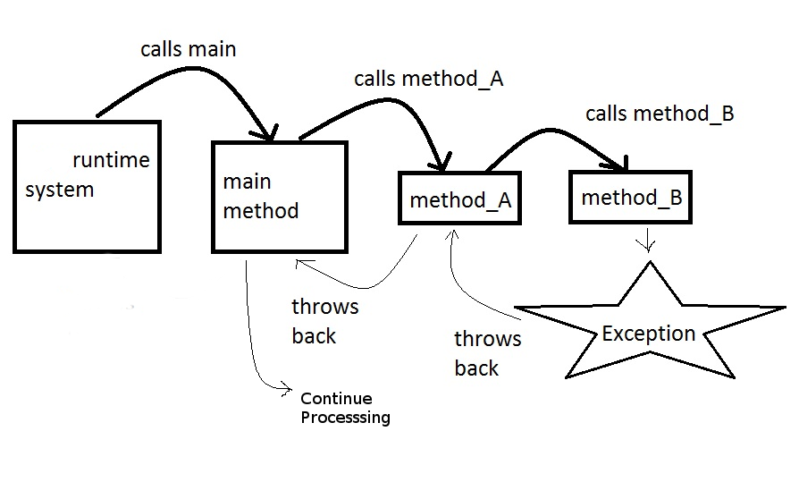
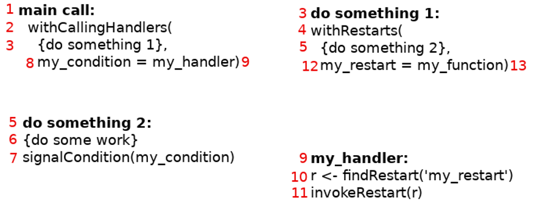

```{r setup, include=FALSE}
options(htmltools.dir.version = FALSE)
options(servr.daemon = TRUE)
```

# Condition System

.large[
- `message()`, `warning()`, `stop()`, `try()` and `tryCatch()` are built on the Condition System
- These are used for error handling
- Condition System can do much more
]

---
# Sequence of execution



---
# Components

.large[
1. Signaller
1. Handler
1. Restarting
]

---
# Components - Condition Object

.large[
- An S3 object
- must have the class `condition`

```
structure(
    class = c(condition_class, "condition"),
    list(message = message, call = call, ...)
  )
```
]

---
# Components - Signaller

.large[
- `signalCondition()` raises a condition object

`
signalCondition(skip_entry_condition(text))
`
]


---
# Components - Handler
.large[
- `withCallHandlers()` catches the raised condition


```
withCallingHandlers(
  {some code},
  condition_class_1 = handler_function_1,
  condition_class_2 = handler_function_2
)
```

```
withCallingHandlers(
  parse_file(file),
  skip_entry = skip_entry_handler,
  keep_entry = keep_entry_handler
)
```
]


---
# Components - Restart
.large[
- `findRestart()` finds a restart label
- `invokeRestart()` transfer control to the restart

```
condition_handler_factory <- function(restart_name) {
  function(cond) {
    restart <- findRestart(restart_name)
    if (is.null(restart)) { return() }

    invokeRestart(restart)
  }
}
```
]
---

# Components - Restart
.large[
- `withRestart()` entry point for restart

```
withRestarts(
  {some code},
  restart_name_1 = restart_function_1,
  restart_name_2 = restart_function_2
)
```

```
withRestarts(
  choose_entry_test(text, p_skip = 0.5),
  skip_entry = function() NULL,
  keep_entry = function() parse_entry(text)
)
```
]

---
# Call Stack



---
# Thank You

## References
* http://www.gigamonkeys.com/book/beyond-exception-handling-conditions-and-restarts.html
* https://adv-r.hadley.nz/conditions.html
* http://adv-r.had.co.nz/beyond-exception-handling.html
* http://adv-r.had.co.nz/Exceptions-Debugging.html
