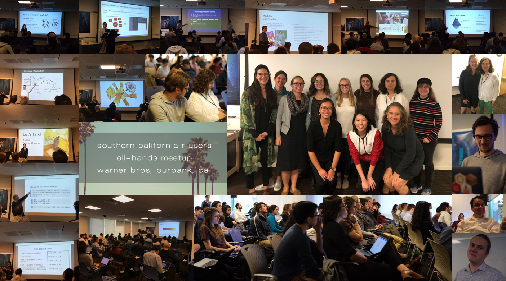

<!-- README.md is generated from README.Rmd. Please edit that file -->

# SoCal All Hands useR Meeting 2019

|         Session |                                                                                                 Presenters |                                                                                                                                                                                                                                             Talk |
| --------------: | ---------------------------------------------------------------------------------------------------------: | -----------------------------------------------------------------------------------------------------------------------------------------------------------------------------------------------------------------------------------------------: |
|       Workshops | [Malcolm Barrett](https://twitter.com/malco_barrett), [Emil Hvitfeldt](https://twitter.com/Emil_Hvitfeldt) | “Designing ggplots: making clear figures that communicate” workshop: [Slides](https://designing-ggplots.netlify.com/), [Course package](https://github.com/malcolmbarrett/designing.ggplots), [RStudio Cloud Workspace](http://bit.ly/design_gg) |
|                 |                                                       [Malcolm Barrett](https://twitter.com/malco_barrett) |                                                                                                                                                                                                   [Welcome](https://socal-allhands.netlify.com/) |
|      Long Talks |                                                              [Alan Dipert](https://twitter.com/alandipert) |                                                                                                          [Software Engineering with Shiny](https://docs.google.com/presentation/d/1ZHjQVjHR4jE3bG8HU1iDAFDaATSp6q68Gt2lFom9iX4/edit?usp=sharing) |
|                 |                                         [Qinghua Song](https://www.linkedin.com/in/song-qinghua-40352b12/) |                                                                                                                                                                                                  Artificial Intelligence & Analytical Innovation |
|                 |                                            [Peter Foley](https://www.linkedin.com/in/peter-foley-6600482/) |                                                                                                                           [Staying clean and DRY - best practices for code reuse and collaboration](https://github.com/peterfoley/clean_and_dry) |
| Lightning Talks |                                                                       [An Bui](https://twitter.com/_anbui) |                                                                                                                                            [Exploring communities with ‘vegan’ - an introduction to community analysis](2019-11-socal_useR.pptx) |
|                 |                                       [Steven Slezak](https://www.linkedin.com/in/steven-slezak-a3243914/) |                                                                                                                              [The Linear Algebra Behind Machine Learning: Under the Hood with Regression Analysis](LARUG%20Lightning%20Talk.pdf) |
|                 |                                                      [Wendy Christensen](https://twitter.com/wchristensen) |                                                                                                                                     [Macgyvering with R: Creating a Work Schedule](Macgyvering%20with%20R_%20Creating%20a%20Work%20Schedule.pdf) |
|                 |                                                          [John Peach](https://www.linkedin.com/in/jpeach/) |                                                                                                                                              [Condition System in R](2017-01-26%20-%20SoCal%20R%20All%20hands%20-%20Condition%20System%20in%20R) |
|    Endnote Talk |                                                    [Julia Stewart Lowndes](https://twitter.com/juliesquid) |                                                                                                                                                    [R for better science in less time](https://openscapes.github.io/slides/betterscience/socalR) |

### Live-Tweets: <https://zhiyang.netlify.com/post/socalr2019/>

<!-- badges: start -->

<!-- badges: end -->
